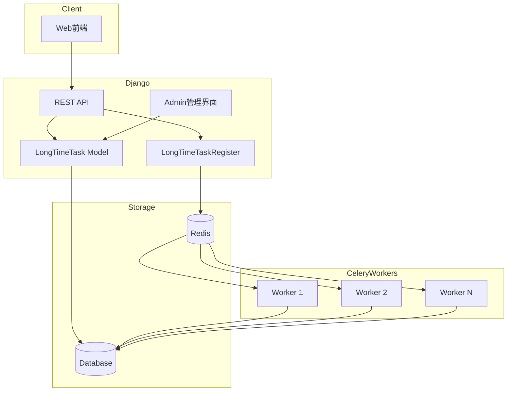
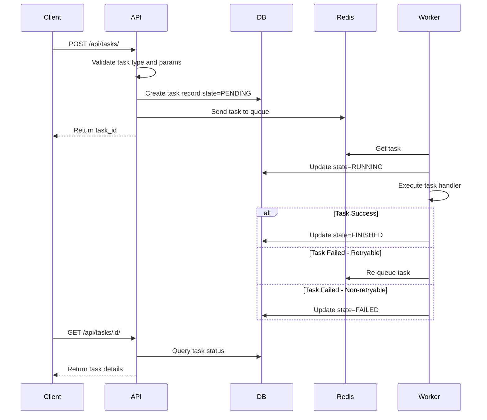

# Django Celery 后台任务管理系统设计方案

## 1. 系统架构概览



## 2. 数据模型设计

### 2.1 LongTimeTask 模型

```python
# long_time_task/models.py

from django.db import models


class TaskState(models.TextChoices):
    """任务状态枚举"""
    PENDING = 'PENDING', '等待执行'
    RUNNING = 'RUNNING', '正在执行'
    FINISHED = 'FINISHED', '已完成'
    FAILED = 'FAILED', '执行失败'


class LongTimeTask(models.Model):
    """长耗时任务模型"""
    
    # 主键使用自增ID
    id = models.BigAutoField(primary_key=True)
    
    # Celery任务ID
    celery_task_id = models.CharField(
        max_length=255, 
        unique=True, 
        db_index=True,
        verbose_name='Celery任务ID'
    )
    
    # 任务类型 - 对应注册器中的任务标识符
    task_type = models.CharField(
        max_length=100, 
        db_index=True,
        verbose_name='任务类型'
    )
    
    # 任务参数 - JSON格式存储
    task_params = models.TextField(
        default='{}',
        verbose_name='任务参数'
    )
    
    # 任务状态
    state = models.CharField(
        max_length=20,
        choices=TaskState.choices,
        default=TaskState.PENDING,
        db_index=True,
        verbose_name='任务状态'
    )
    
    # 任务结果 - JSON格式或文件路径
    result = models.TextField(
        null=True, 
        blank=True,
        verbose_name='任务结果'
    )
    
    # 时间字段
    create_at = models.DateTimeField(
        auto_now_add=True,
        db_index=True,
        verbose_name='创建时间'
    )
    start_at = models.DateTimeField(
        null=True, 
        blank=True,
        verbose_name='开始执行时间'
    )
    finish_at = models.DateTimeField(
        null=True, 
        blank=True,
        verbose_name='完成时间'
    )
    
    # 错误信息
    error_message = models.TextField(
        null=True, 
        blank=True,
        verbose_name='错误信息'
    )

    class Meta:
        db_table = 'long_time_task'
        verbose_name = '长耗时任务'
        verbose_name_plural = '长耗时任务'
        ordering = ['-create_at']
        indexes = [
            models.Index(fields=['state', 'create_at']),
            models.Index(fields=['task_type', 'state']),
        ]

    def __str__(self):
        return f'{self.task_type}#{self.id} - {self.state}'
```

### 2.2 数据库索引设计

| 字段 | 索引类型 | 用途 |
|------|----------|------|
| `celery_task_id` | UNIQUE | 快速通过Celery ID查找任务 |
| `task_type` | INDEX | 按任务类型筛选 |
| `state` | INDEX | 按状态筛选 |
| `create_at` | INDEX | 按时间排序和筛选 |
| `(state, create_at)` | COMPOSITE | 组合查询优化 |
| `(task_type, state)` | COMPOSITE | 组合查询优化 |

## 3. 任务注册机制

### 3.1 LongTimeTaskRegister 设计

```python
# long_time_task/registry.py

import json
import logging
from dataclasses import dataclass, field
from typing import Callable, Dict, Any, Optional, Type
from functools import wraps

logger = logging.getLogger(__name__)


@dataclass
class TaskConfig:
    """任务配置"""
    name: str                                    # 任务名称
    handler: Callable                            # 处理函数
    description: str = ''                        # 任务描述
    timeout: int = 3600                          # 超时时间(秒)
    soft_timeout: int = 3300                     # 软超时时间(秒)
    max_retries: int = 3                         # 最大重试次数
    retry_delay: int = 60                        # 重试延迟(秒)
    retry_backoff: bool = True                   # 是否使用指数退避
    retry_backoff_max: int = 600                 # 最大退避时间(秒)
    queue: str = 'default'                       # 任务队列
    priority: int = 5                            # 优先级 (1-10, 10最高)
    param_schema: Optional[Dict] = None          # 参数验证schema
    retryable_exceptions: tuple = field(         # 可重试的异常类型
        default_factory=lambda: (ConnectionError, TimeoutError)
    )


class LongTimeTaskRegister:
    """长耗时任务注册器 - 单例模式"""
    
    _instance = None
    _tasks: Dict[str, TaskConfig] = {}
    
    def __new__(cls):
        if cls._instance is None:
            cls._instance = super().__new__(cls)
        return cls._instance
    
    @classmethod
    def register(
        cls,
        task_type: str,
        description: str = '',
        timeout: int = 3600,
        soft_timeout: int = 3300,
        max_retries: int = 3,
        retry_delay: int = 60,
        retry_backoff: bool = True,
        retry_backoff_max: int = 600,
        queue: str = 'default',
        priority: int = 5,
        param_schema: Optional[Dict] = None,
        retryable_exceptions: tuple = (ConnectionError, TimeoutError),
    ):
        """
        装饰器方式注册任务
        
        使用示例:
        @LongTimeTaskRegister.register(
            task_type='data_analysis',
            description='数据分析任务',
            timeout=7200,
            queue='heavy'
        )
        def analyze_data(task_id: int, params: dict) -> dict:
            # 任务处理逻辑
            return {'status': 'success', 'data': result}
        """
        def decorator(func: Callable):
            config = TaskConfig(
                name=task_type,
                handler=func,
                description=description,
                timeout=timeout,
                soft_timeout=soft_timeout,
                max_retries=max_retries,
                retry_delay=retry_delay,
                retry_backoff=retry_backoff,
                retry_backoff_max=retry_backoff_max,
                queue=queue,
                priority=priority,
                param_schema=param_schema,
                retryable_exceptions=retryable_exceptions,
            )
            cls._tasks[task_type] = config
            logger.info(f'Registered task: {task_type}')
            
            @wraps(func)
            def wrapper(*args, **kwargs):
                return func(*args, **kwargs)
            return wrapper
        return decorator
    
    @classmethod
    def get_task(cls, task_type: str) -> Optional[TaskConfig]:
        """获取任务配置"""
        return cls._tasks.get(task_type)
    
    @classmethod
    def get_all_tasks(cls) -> Dict[str, TaskConfig]:
        """获取所有注册的任务"""
        return cls._tasks.copy()
    
    @classmethod
    def validate_params(cls, task_type: str, params: dict) -> bool:
        """验证任务参数"""
        config = cls.get_task(task_type)
        if not config:
            raise ValueError(f'Unknown task type: {task_type}')
        
        if config.param_schema:
            # 这里可以集成 jsonschema 或 pydantic 进行验证
            # 简单实现：检查必需字段
            required = config.param_schema.get('required', [])
            for field in required:
                if field not in params:
                    raise ValueError(f'Missing required parameter: {field}')
        return True
    
    @classmethod
    def is_retryable(cls, task_type: str, exception: Exception) -> bool:
        """判断异常是否可重试"""
        config = cls.get_task(task_type)
        if not config:
            return False
        return isinstance(exception, config.retryable_exceptions)
```

### 3.2 任务注册示例

```python
# long_time_task/tasks_definitions.py

from .registry import LongTimeTaskRegister


@LongTimeTaskRegister.register(
    task_type='data_analysis',
    description='数据分析任务',
    timeout=7200,
    soft_timeout=6900,
    max_retries=3,
    queue='heavy',
    param_schema={
        'required': ['dataset_id'],
        'properties': {
            'dataset_id': {'type': 'integer'},
            'analysis_type': {'type': 'string'},
        }
    }
)
def analyze_data(task_id: int, params: dict) -> dict:
    """数据分析任务处理函数"""
    dataset_id = params.get('dataset_id')
    analysis_type = params.get('analysis_type', 'basic')
    
    # 执行分析逻辑...
    
    # 返回结果
    return {
        'dataset_id': dataset_id,
        'analysis_type': analysis_type,
        'result': 'analysis_complete'
    }


@LongTimeTaskRegister.register(
    task_type='file_processing',
    description='文件处理任务',
    timeout=3600,
    queue='default',
    param_schema={
        'required': ['file_path'],
        'properties': {
            'file_path': {'type': 'string'},
            'output_format': {'type': 'string'},
        }
    }
)
def process_file(task_id: int, params: dict) -> dict:
    """文件处理任务"""
    file_path = params.get('file_path')
    output_format = params.get('output_format', 'json')
    
    # 处理逻辑...
    
    return {
        'input_file': file_path,
        'output_file': f'/results/{task_id}.{output_format}'
    }


@LongTimeTaskRegister.register(
    task_type='report_generation',
    description='报告生成任务',
    timeout=1800,
    queue='default',
    priority=7
)
def generate_report(task_id: int, params: dict) -> dict:
    """报告生成任务"""
    report_type = params.get('report_type', 'summary')
    
    # 生成报告逻辑...
    
    return {
        'report_path': f'/reports/{task_id}.pdf'
    }
```

## 4. Celery 配置

### 4.1 Celery 配置文件

```python
# demo/celery.py

import os
from celery import Celery

# 设置Django settings模块
os.environ.setdefault('DJANGO_SETTINGS_MODULE', 'demo.settings')

app = Celery('demo')

# 从Django settings加载配置
app.config_from_object('django.conf:settings', namespace='CELERY')

# 自动发现任务
app.autodiscover_tasks()
```

### 4.2 Django Settings 中的 Celery 配置

```python
# demo/settings.py 添加以下配置

# ============== Celery 配置 ==============

# Broker 配置 (Redis)
CELERY_BROKER_URL = 'redis://localhost:6379/0'
CELERY_RESULT_BACKEND = 'redis://localhost:6379/1'

# 序列化配置
CELERY_ACCEPT_CONTENT = ['json']
CELERY_TASK_SERIALIZER = 'json'
CELERY_RESULT_SERIALIZER = 'json'

# 时区配置
CELERY_TIMEZONE = 'Asia/Shanghai'
CELERY_ENABLE_UTC = True

# Worker 配置
CELERY_WORKER_CONCURRENCY = 4              # 并发worker数
CELERY_WORKER_PREFETCH_MULTIPLIER = 1      # 预取任务数
CELERY_WORKER_MAX_TASKS_PER_CHILD = 100    # 每个worker处理的最大任务数

# 任务配置
CELERY_TASK_SOFT_TIME_LIMIT = 3300         # 软超时 (秒)
CELERY_TASK_TIME_LIMIT = 3600              # 硬超时 (秒)
CELERY_TASK_ACKS_LATE = True               # 任务完成后确认
CELERY_TASK_REJECT_ON_WORKER_LOST = True   # worker丢失时拒绝任务

# 重试配置
CELERY_TASK_DEFAULT_RETRY_DELAY = 60       # 默认重试延迟
CELERY_TASK_MAX_RETRIES = 3                # 默认最大重试次数

# 结果配置
CELERY_RESULT_EXPIRES = 86400              # 结果过期时间 (24小时)
CELERY_TASK_TRACK_STARTED = True           # 跟踪任务开始状态

# 任务路由配置
CELERY_TASK_ROUTES = {
    'long_time_task.celery_tasks.execute_long_time_task': {
        'queue': 'default'
    },
}

# 队列配置
CELERY_TASK_QUEUES = {
    'default': {
        'exchange': 'default',
        'routing_key': 'default',
    },
    'heavy': {
        'exchange': 'heavy',
        'routing_key': 'heavy',
    },
    'priority': {
        'exchange': 'priority',
        'routing_key': 'priority',
    },
}

# 任务优先级
CELERY_TASK_DEFAULT_PRIORITY = 5
CELERY_BROKER_TRANSPORT_OPTIONS = {
    'priority_steps': list(range(10)),
    'sep': ':',
    'queue_order_strategy': 'priority',
}
```

### 4.3 Celery 任务执行器

```python
# long_time_task/celery_tasks.py

import json
import logging
import traceback
from datetime import datetime
from celery import shared_task
from celery.exceptions import SoftTimeLimitExceeded
from django.utils import timezone

from .models import LongTimeTask, TaskState
from .registry import LongTimeTaskRegister

logger = logging.getLogger(__name__)


@shared_task(
    bind=True,
    autoretry_for=(ConnectionError, TimeoutError),
    retry_backoff=True,
    retry_backoff_max=600,
    retry_jitter=True,
    max_retries=3,
)
def execute_long_time_task(self, task_id: int):
    """
    执行长耗时任务的Celery任务
    
    Args:
        task_id: LongTimeTask模型的ID
    """
    try:
        # 获取任务记录
        task = LongTimeTask.objects.get(id=task_id)
        
        # 更新任务状态为运行中
        task.state = TaskState.RUNNING
        task.start_at = timezone.now()
        task.celery_task_id = self.request.id
        task.save(update_fields=['state', 'start_at', 'celery_task_id'])
        
        # 获取任务配置
        task_config = LongTimeTaskRegister.get_task(task.task_type)
        if not task_config:
            raise ValueError(f'Unknown task type: {task.task_type}')
        
        # 解析任务参数
        params = json.loads(task.task_params)
        
        # 执行任务处理函数
        logger.info(f'Executing task {task_id}: {task.task_type}')
        result = task_config.handler(task_id, params)
        
        # 更新任务状态为完成
        task.state = TaskState.FINISHED
        task.finish_at = timezone.now()
        task.result = json.dumps(result, ensure_ascii=False)
        task.save(update_fields=['state', 'finish_at', 'result'])
        
        logger.info(f'Task {task_id} completed successfully')
        return {'task_id': task_id, 'status': 'success'}
        
    except SoftTimeLimitExceeded:
        # 软超时处理
        logger.warning(f'Task {task_id} soft time limit exceeded')
        _mark_task_failed(task_id, 'Task execution time limit exceeded')
        raise
        
    except Exception as e:
        # 判断是否可重试
        task = LongTimeTask.objects.get(id=task_id)
        task_config = LongTimeTaskRegister.get_task(task.task_type)
        
        if task_config and LongTimeTaskRegister.is_retryable(task.task_type, e):
            # 可重试异常，让Celery处理重试
            logger.warning(f'Task {task_id} failed with retryable error: {e}')
            if self.request.retries < task_config.max_retries:
                raise self.retry(exc=e, countdown=task_config.retry_delay)
        
        # 不可重试或已达最大重试次数，标记为失败
        error_msg = f'{type(e).__name__}: {str(e)}\n{traceback.format_exc()}'
        _mark_task_failed(task_id, error_msg)
        logger.error(f'Task {task_id} failed: {error_msg}')
        return {'task_id': task_id, 'status': 'failed', 'error': str(e)}


def _mark_task_failed(task_id: int, error_message: str):
    """标记任务为失败状态"""
    try:
        task = LongTimeTask.objects.get(id=task_id)
        task.state = TaskState.FAILED
        task.finish_at = timezone.now()
        task.error_message = error_message
        task.save(update_fields=['state', 'finish_at', 'error_message'])
    except LongTimeTask.DoesNotExist:
        logger.error(f'Task {task_id} not found when marking as failed')
```

## 5. API 接口设计

### 5.1 API 接口规范

| 接口 | 方法 | 路径 | 描述 |
|------|------|------|------|
| 提交任务 | POST | `/api/tasks/` | 创建并提交新任务 |
| 查询任务状态 | GET | `/api/tasks/{id}/` | 获取单个任务详情 |
| 任务列表 | GET | `/api/tasks/` | 获取任务列表(支持筛选) |

### 5.2 API 实现

```python
# long_time_task/views.py

import json
import logging
from django.http import JsonResponse
from django.views import View
from django.views.decorators.csrf import csrf_exempt
from django.utils.decorators import method_decorator
from django.core.paginator import Paginator

from .models import LongTimeTask, TaskState
from .registry import LongTimeTaskRegister
from .celery_tasks import execute_long_time_task

logger = logging.getLogger(__name__)


@method_decorator(csrf_exempt, name='dispatch')
class TaskSubmitView(View):
    """任务提交API"""
    
    def post(self, request):
        """
        提交新任务
        
        Request Body:
        {
            "task_type": "data_analysis",
            "params": {"dataset_id": 123, "analysis_type": "full"}
        }
        
        Response:
        {
            "success": true,
            "task_id": 1,
            "message": "Task submitted successfully"
        }
        """
        try:
            data = json.loads(request.body)
            task_type = data.get('task_type')
            params = data.get('params', {})
            
            # 验证任务类型
            task_config = LongTimeTaskRegister.get_task(task_type)
            if not task_config:
                return JsonResponse({
                    'success': False,
                    'error': f'Unknown task type: {task_type}'
                }, status=400)
            
            # 验证参数
            try:
                LongTimeTaskRegister.validate_params(task_type, params)
            except ValueError as e:
                return JsonResponse({
                    'success': False,
                    'error': str(e)
                }, status=400)
            
            # 创建任务记录
            task = LongTimeTask.objects.create(
                task_type=task_type,
                task_params=json.dumps(params, ensure_ascii=False),
                state=TaskState.PENDING,
                celery_task_id='',  # 稍后由Celery填充
            )
            
            # 提交到Celery队列
            celery_task = execute_long_time_task.apply_async(
                args=[task.id],
                queue=task_config.queue,
                priority=task_config.priority,
            )
            
            # 更新Celery任务ID
            task.celery_task_id = celery_task.id
            task.save(update_fields=['celery_task_id'])
            
            logger.info(f'Task {task.id} submitted: {task_type}')
            
            return JsonResponse({
                'success': True,
                'task_id': task.id,
                'message': 'Task submitted successfully'
            })
            
        except json.JSONDecodeError:
            return JsonResponse({
                'success': False,
                'error': 'Invalid JSON'
            }, status=400)
        except Exception as e:
            logger.exception('Error submitting task')
            return JsonResponse({
                'success': False,
                'error': str(e)
            }, status=500)


class TaskDetailView(View):
    """任务详情API"""
    
    def get(self, request, task_id):
        """
        获取任务详情
        
        Response:
        {
            "success": true,
            "task": {
                "id": 1,
                "task_type": "data_analysis",
                "state": "RUNNING",
                "result": null,
                "error_message": null,
                "create_at": "2024-01-01T10:00:00Z",
                "start_at": "2024-01-01T10:00:01Z",
                "finish_at": null
            }
        }
        """
        try:
            task = LongTimeTask.objects.get(id=task_id)
            
            task_data = {
                'id': task.id,
                'task_type': task.task_type,
                'state': task.state,
                'create_at': task.create_at.isoformat() if task.create_at else None,
                'start_at': task.start_at.isoformat() if task.start_at else None,
                'finish_at': task.finish_at.isoformat() if task.finish_at else None,
            }
            
            # 只有完成或失败时才返回结果/错误信息
            if task.state == TaskState.FINISHED:
                task_data['result'] = json.loads(task.result) if task.result else None
            elif task.state == TaskState.FAILED:
                task_data['error_message'] = task.error_message
            
            return JsonResponse({
                'success': True,
                'task': task_data
            })
            
        except LongTimeTask.DoesNotExist:
            return JsonResponse({
                'success': False,
                'error': 'Task not found'
            }, status=404)


class TaskListView(View):
    """任务列表API"""
    
    def get(self, request):
        """
        获取任务列表
        
        Query Parameters:
        - state: 按状态筛选 (PENDING/RUNNING/FINISHED/FAILED)
        - task_type: 按任务类型筛选
        - page: 页码 (默认1)
        - page_size: 每页数量 (默认20, 最大100)
        
        Response:
        {
            "success": true,
            "tasks": [...],
            "total": 100,
            "page": 1,
            "page_size": 20,
            "total_pages": 5
        }
        """
        queryset = LongTimeTask.objects.all()
        
        # 筛选条件
        state = request.GET.get('state')
        if state and state in TaskState.values:
            queryset = queryset.filter(state=state)
        
        task_type = request.GET.get('task_type')
        if task_type:
            queryset = queryset.filter(task_type=task_type)
        
        # 分页
        page = int(request.GET.get('page', 1))
        page_size = min(int(request.GET.get('page_size', 20)), 100)
        
        paginator = Paginator(queryset, page_size)
        page_obj = paginator.get_page(page)
        
        tasks = [{
            'id': task.id,
            'task_type': task.task_type,
            'state': task.state,
            'create_at': task.create_at.isoformat() if task.create_at else None,
            'finish_at': task.finish_at.isoformat() if task.finish_at else None,
        } for task in page_obj]
        
        return JsonResponse({
            'success': True,
            'tasks': tasks,
            'total': paginator.count,
            'page': page,
            'page_size': page_size,
            'total_pages': paginator.num_pages
        })
```

### 5.3 URL 配置

```python
# long_time_task/urls.py

from django.urls import path
from .views import TaskSubmitView, TaskDetailView, TaskListView

urlpatterns = [
    path('tasks/', TaskSubmitView.as_view(), name='task_submit'),
    path('tasks/list/', TaskListView.as_view(), name='task_list'),
    path('tasks/<int:task_id>/', TaskDetailView.as_view(), name='task_detail'),
]
```

```python
# demo/urls.py

from django.contrib import admin
from django.urls import path, include

urlpatterns = [
    path('admin/', admin.site.urls),
    path('api/', include('long_time_task.urls')),
]
```

## 6. 服务层

```python
# long_time_task/services.py

import json
import logging
from django.utils import timezone
from .models import LongTimeTask, TaskState

logger = logging.getLogger(__name__)


def get_task_status(task_id: int) -> dict:
    """获取任务状态"""
    try:
        task = LongTimeTask.objects.get(id=task_id)
        return {
            'id': task.id,
            'state': task.state,
        }
    except LongTimeTask.DoesNotExist:
        return None
```

## 7. Admin 管理界面

```python
# long_time_task/admin.py

from django.contrib import admin
from django.utils.html import format_html
from .models import LongTimeTask, TaskState


@admin.register(LongTimeTask)
class LongTimeTaskAdmin(admin.ModelAdmin):
    """长耗时任务管理"""
    
    list_display = [
        'id', 
        'task_type', 
        'state_display', 
        'create_at', 
        'start_at',
        'finish_at',
    ]
    
    list_filter = [
        'state',
        'task_type',
        'create_at',
    ]
    
    search_fields = [
        'id',
        'celery_task_id',
        'task_type',
    ]
    
    readonly_fields = [
        'id',
        'celery_task_id',
        'task_type',
        'task_params',
        'state',
        'result',
        'create_at',
        'start_at',
        'finish_at',
        'error_message',
    ]
    
    ordering = ['-create_at']
    
    list_per_page = 50
    
    date_hierarchy = 'create_at'
    
    fieldsets = (
        ('基本信息', {
            'fields': ('id', 'celery_task_id', 'task_type', 'task_params')
        }),
        ('状态信息', {
            'fields': ('state',)
        }),
        ('时间信息', {
            'fields': ('create_at', 'start_at', 'finish_at')
        }),
        ('结果信息', {
            'fields': ('result', 'error_message'),
            'classes': ('collapse',)
        }),
    )
    
    def state_display(self, obj):
        """状态显示"""
        colors = {
            TaskState.PENDING: '#ffc107',   # 黄色
            TaskState.RUNNING: '#17a2b8',   # 蓝色
            TaskState.FINISHED: '#28a745',  # 绿色
            TaskState.FAILED: '#dc3545',    # 红色
        }
        color = colors.get(obj.state, '#6c757d')
        return format_html(
            '<span style="color: {}; font-weight: bold;">{}</span>',
            color,
            obj.get_state_display()
        )
    state_display.short_description = '状态'
    state_display.admin_order_field = 'state'
    
    def has_add_permission(self, request):
        """禁止在Admin中添加任务"""
        return False
    
    def has_delete_permission(self, request, obj=None):
        """禁止在Admin中删除任务"""
        return False
    
    def has_change_permission(self, request, obj=None):
        """禁止在Admin中修改任务"""
        return False
```

## 8. 项目文件结构

```
django_celery_task_manage/
├── demo/
│   ├── __init__.py          # 导入celery app
│   ├── celery.py             # Celery配置
│   ├── settings.py           # Django设置 + Celery配置
│   ├── urls.py               # URL路由
│   ├── asgi.py
│   └── wsgi.py
├── long_time_task/
│   ├── __init__.py
│   ├── admin.py              # Admin管理界面
│   ├── apps.py
│   ├── models.py             # 数据模型
│   ├── views.py              # API视图
│   ├── urls.py               # API路由
│   ├── registry.py           # 任务注册器
│   ├── celery_tasks.py       # Celery任务
│   ├── services.py           # 服务层
│   ├── tasks_definitions.py  # 任务定义
│   └── migrations/
├── manage.py
├── pyproject.toml
└── requirements.txt
```

## 9. 依赖配置

```toml
# pyproject.toml

[project]
name = "django-celery-task-manage"
version = "0.1.0"
description = "Django Celery Task Management System"
readme = "README.md"
requires-python = ">=3.10"
dependencies = [
    "django>=4.2",
    "celery>=5.3",
    "redis>=5.0",
]

[project.optional-dependencies]
dev = [
    "pytest",
    "pytest-django",
]
```

## 10. 部署指南

### 10.1 开发环境启动

```bash
# 1. 安装依赖
pip install -e .

# 2. 启动Redis (Docker方式)
docker run -d --name redis -p 6379:6379 redis:7-alpine

# 3. 数据库迁移
python manage.py migrate

# 4. 启动Django开发服务器
python manage.py runserver

# 5. 启动Celery Worker (新终端)
celery -A demo worker -l INFO -Q default,heavy,priority

# 6. (可选) 启动Celery Beat (定时任务)
celery -A demo beat -l INFO
```

### 10.2 生产环境部署

```bash
# 使用Supervisor管理Celery Worker

# /etc/supervisor/conf.d/celery_worker.conf
[program:celery_worker]
command=/path/to/venv/bin/celery -A demo worker -l INFO -Q default,heavy,priority --concurrency=4
directory=/path/to/project
user=www-data
autostart=true
autorestart=true
stdout_logfile=/var/log/celery/worker.log
stderr_logfile=/var/log/celery/worker_error.log
```

### 10.3 水平扩展

```bash
# 启动多个Worker实例处理不同队列

# Worker 1: 处理默认队列
celery -A demo worker -l INFO -Q default --concurrency=4 -n worker1@%h

# Worker 2: 处理重型任务队列
celery -A demo worker -l INFO -Q heavy --concurrency=2 -n worker2@%h

# Worker 3: 处理优先级队列
celery -A demo worker -l INFO -Q priority --concurrency=4 -n worker3@%h
```

## 11. 任务执行流程



## 12. 错误处理策略

| 错误类型 | 处理策略 | 示例 |
|----------|----------|------|
| 临时性错误 | 自动重试 | 网络超时、资源暂时不可用 |
| 永久性错误 | 立即失败 | 参数错误、权限不足 |
| 超时错误 | 软超时警告 + 硬超时终止 | 任务执行时间过长 |
| 未知错误 | 记录日志 + 标记失败 | 未捕获的异常 |

## 13. 下一步实施计划

1. **完善数据模型** - 更新 [`models.py`](long_time_task/models.py) 添加缺失字段
2. **创建任务注册器** - 新建 [`registry.py`](long_time_task/registry.py)
3. **配置Celery** - 新建 [`demo/celery.py`](demo/celery.py) 和更新 [`settings.py`](demo/settings.py)
4. **实现API** - 更新 [`views.py`](long_time_task/views.py) 和新建 [`urls.py`](long_time_task/urls.py)
5. **实现Celery任务** - 新建 [`celery_tasks.py`](long_time_task/celery_tasks.py)
6. **完善Admin** - 更新 [`admin.py`](long_time_task/admin.py)
7. **添加示例任务** - 新建 [`tasks_definitions.py`](long_time_task/tasks_definitions.py)
8. **更新依赖** - 更新 [`pyproject.toml`](pyproject.toml) -->
